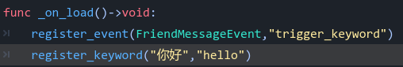
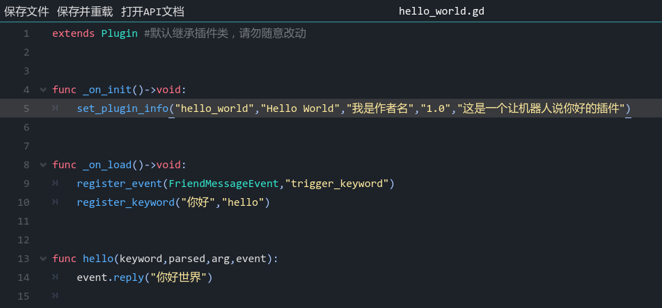

# 🔮 插件开发

找不到符合自己需求的插件？脑海中有一些好点子想要实现？别担心，RainyBot正是为了人人都能开发属于自己的Bot为目标而设计的；请抽出几分钟的时间，试着跟随下方的渐进式教程制作你的第一个插件，我相信你会爱上RainyBot的易用性的\~

### 你好，世界

让我们实现一个简单却有里程碑般意义的功能-让机器人回应你的问候语 "你好"

* 在主菜单中选择 `插件->插件管理器`来打开插件管理器，在新建插件输入框中输入`hello_world`并点击`新建插件`按钮来创建新插件

* 此时，插件列表中应该出现了新的hello\_world.gd选项，但目前仍无法被加载，这是因为缺少了一些必要的插件信息，让我们将它补齐吧\~

* 选中`hello_world.gd`，点击底部的编辑按钮，内置插件编辑器将会启动并加载插件的脚本文件。聪明的你应该会注意到，插件文件中已经存在一些文本；这些是RainyBot为您默认填写的插件模板，以便于您快速开始插件开发。
* 让我们找到`func _on_init()->void:`这一行，这是一个虚函数，位于其中的代码行将会在插件脚本文件被读取信息时执行。您应该能看到其中已经有一个被注释的`#set_plugin_info("","","","","")`函数，这个函数将会在插件文件被读取时告诉RainyBot插件的相关信息。

* 让我们移除这行函数前方的`#`注释符号来允许它被执行，并在其中的五个双引号中分别填写:插件的唯一ID(建议全小写英文字母+下划线，不可与已加载的其他插件重名)，插件显示名称，插件作者，插件版本，插件描述。例如，在这里可以填写为`set_plugin_info("hello_world","Hello World","我是作者名","1.0","这是一个让机器人说你好的插件")`。

* 编辑完毕后，让我们点击插件编辑器顶部的保存并重载按钮，此时插件应该能够被正常加载，但它还没有任何功能。现在，请找到`_on_load()`虚函数，位于其中的代码将在插件被成功加载后执行一次。
* 在这个函数中，删除`#register_event(Event,"")`函数前方的`#`注释符号来允许它被执行。这行函数可以将插件注册为响应指定的事件。让我们把这个函数中的第一个参数的`Event`修改为`FriendMessageEvent`，这样一来，插件将会响应好友消息事件。随后，让我们在第二个参数的双引号中填入`trigger_keyword`，这是一个RainyBot内置的函数，被执行时将会尝试进行关键词匹配。如此填写意味着插件在接收到好友消息事件时，将试图用好友消息事件中的消息来匹配并触发关键词。
* 随后，在`_on_load()`虚函数中删除`#register_keyword("","")`函数前方的`#`注释符号来允许它被执行。这行函数可以注册指定的关键词并绑定到指定的自定义函数。让我们将第一个参数设置为`"你好"`，第二个参数设置为`"hello"`。这样一来，在匹配到关键词"你好"时，将会执行插件中定义的"hello"函数。

* 我们目前还没有定义"hello"函数，因此请翻到插件底部的空白区域，添加新的一行内容: `func hello(keyword,parsed,arg,event):`
* 这样一来，我们便成功定义了一个新的函数hello，这个函数将接受来自被触发的关键词的四个参数，从左到右分别为 触发这个函数的关键词文本，被解析后的关键词文本，关键词被触发时附带的参数，触发关键词的事件。我们目前不需要知道前三个参数的作用，只需要关注第四个"event"参数即可。
* 在hello函数被关键词调用时，我们应该能通过event参数接收到触发了关键词的那次事件。对于所有消息事件，其中都有一个reply(<消息>)函数可以用于回应消息到事件的来源位置。因此，我们只需要在`func hello(keyword,parsed,arg,event):`中写下新的一行 `event.reply("你好世界")`。这样一来，只要你通过好友消息触发了关键词"你好"，那么将会执行你定义的hello函数中的代码，即回复"你好世界"到收到好友消息的原位置，也就是与你的聊天会话中。

* 点击插件编辑器的`保存并重载`按钮，试着给Bot私聊发送一条"你好"，然后见证这历史性的的瞬间吧\~
* 恭喜，你完成了你的第一个人机应答插件！您可以随时删除插件模板中没有使用的注释或虚函数，这样可以让整个插件脚本简洁许多

* 出于谨慎起见，本篇教程稍微有些冗长；但实际上，我们只通过8行简短的代码就实现了一个关键词应答插件，且与实际功能相关的代码仅有5行(除去插件类型声明和插件信息声明)。相信本教程过后，您一定认识到了RainyBot插件开发流程的简单易懂。
* 并且，简单不意味着简陋；随意举例来说，在关键词注册函数中，您甚至还可以指定匹配模式，事件传递阻塞，动态关键词等内容。RainyBot为您设置了一些常用的默认值，因此在本教程的插件中您才无需手动设置这些参数。也就是说，RainyBot API被设计为可以根据您的需求自适应，并且不仅局限于函数的参数数量上，还有诸如类型自适应，条件自适应等特性。无论是需要高级用例还是简单的调用，RainyBot都可以让您尽可能简易地来完成。

### 从现有插件中学习

我们为RainyBot准备了一些[常见领域的示例插件](https://github.com/Xwdit/RainyBot-Docs/tree/main/examples)，并且为每行代码都进行了详细的注释。您可以尝试结合[RainyBot API](../../api/)阅读并理解它们，还可以尝试自己动手来修改/增加它们的功能。正所谓实践是最好的老师，相信您一定可以从示例插件中学习到更多RainyBot的开发与使用技巧\~

如果您遇到任何问题，请大胆的到[社区群聊](https://qm.qq.com/cgi-bin/qm/qr?k=1nKmcY2qdc-q2Q8BYkn1MyhHrfc3oZ58\&jump\_from=webapi)，[交流论坛](https://godoter.cn/t/rainybot)等地进行提问，RainyBot社区的许多热心的小伙伴会帮助您解答您的疑问\~ 并且在这些地方，您还可以找到其他用户发布的插件，虽然注释通常不如示例插件那样完善，但也可以让您学习到一些示例插件中暂未涵盖的知识点
