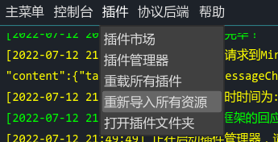
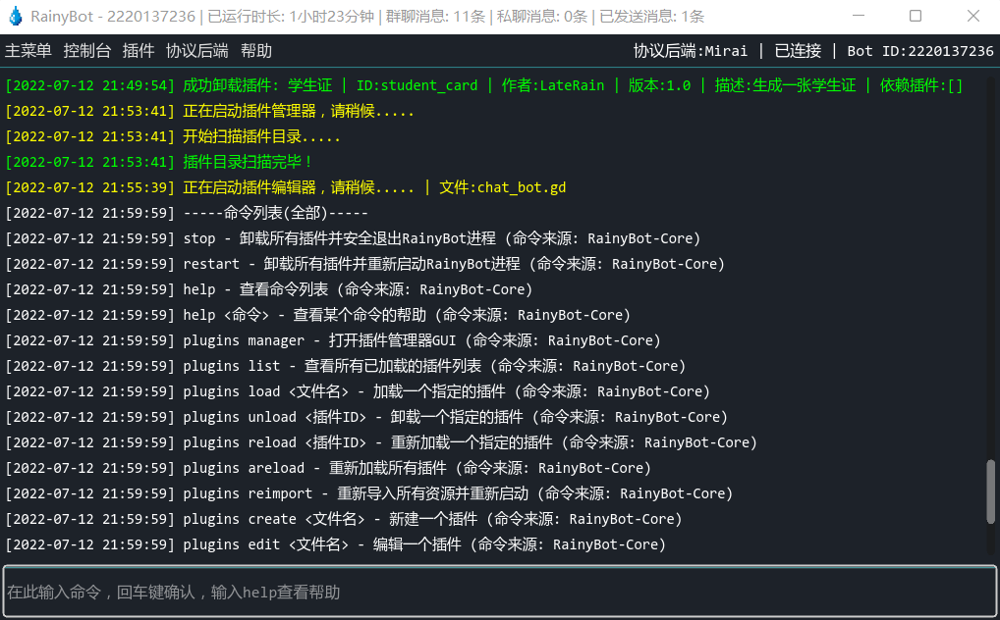

# 🪄 开始使用

如果您已按照前面的说明完成配置并成功运行RainyBot，那么您现在应该已经准备好使用RainyBot的各种功能了\~

下面，将为您简单介绍一些RainyBot使用层面的常用功能，[插件开发](plugin\_dev/)相关内容请参见后续章节。

### 目录结构

在开始之前，让我们先简单了解一下RainyBot的目录结构

```
📂 RainyBot根目录
├── 📂 .godot - 储存各类资源的优化版本，请不要手动删除或修改
├── 📂 adapters - 储存各个协议后端的相关文件，请不要随意删除或修改
|   └── 📂 mirai - Mirai协议后端相关文件
├── 📂 cache - 储存RainyBot与插件运行过程中的各类缓存，将在关闭时自动清空
|   └── 📜 <插件ID>.rca - 某个插件的缓存数据
├── 📂 config - 储存RainyBot与插件的各类配置文件
|   └── 📜 <插件ID>.json - 某个插件的配置文件
├── 📂 data - 储存RainyBot与插件的各类数据
|   └── 📜 <插件ID>.rdb - 某个插件的数据库文件
├── 📂 libs - RainyBot运行所需的各类核心文件，请不要随意修改
├── 📂 logs - 储存RainyBot运行时的控制台日志
├── 📂 plugins - 储存各个插件及其所需的文件
├── 📜 project.godot - 储存了RainyBot运行所需的各类核心参数，请不要随意修改
├── 📜 RainyBot(.exe) - RainyBot的主程序可执行文件
```

### 管理插件

得插件者得天下，RainyBot本身不具备诸如聊天，签到一类的具体功能，但其提供了丰富易用的API以供插件实现各类所需功能；通过各个插件的组合使用，您可以轻松打造出自己梦想中的专属Bot\~

在RainyBot中，您可以通过插件管理器GUI，或控制台指令来管理各个插件。若要启动插件管理器，请在主菜单选择`插件->插件管理器`即可。若要通过指令管理插件，请在控制台中输入`/help plugins`来查看插件管理相关指令


#### 安装/加载插件

插件的安装非常简单，您可以在`插件菜单`或`插件管理器`中选择`打开插件文件夹`，将插件各类文件(至少为一个.gd文件) 放入插件文件夹后，通过插件管理器刷新插件列表，选中新出现的对应文件，点击`重新加载`即可。您也可以通过`/plugins load <文件名>`指令，或`重载所有插件`选项来加载新的插件


有些插件可能依赖于其他插件，对于此类情况，请确保要加载的插件所依赖的插件存在于插件文件夹中，且可被正常加载，否则该插件将会加载失败

需要注意的是，对于包含了各类资源及场景的插件(如图像资源，字体资源等)，请在将其各个文件放入插件目录后，在`插件菜单`中选择`重新导入所有资源`来让RainyBot初始化插件包含的各个资源，否则插件或其场景可能会无法正常加载或工作。



#### 重载/卸载/删除插件

与安装插件类似，您可以通过`plugins`指令或插件管理器界面来重载/卸载/删除各个插件。但是，如果某个正在操作的插件是其他插件的依赖，则操作将会失败；您需要先卸载依赖此插件的其他插件，才能对此插件进行操作。

除对单个插件进行操作外，您还可以批量重载/卸载所有插件。在批量操作时，RainyBot将自动处理依赖关系，因此您无需按顺序手动卸载某些插件。


#### 新建/编辑插件

RainyBot内置了一个功能完善的插件编辑器，拥有基本的`语法高亮/自动补全/错误检查`等功能，您可以通过插件管理器或`plugins`指令来新建/编辑一个插件。编辑时将会自动启动内置的插件编辑器并加载要编辑的插件。编辑完成后，您可以在插件编辑器中选择`保存`或`保存并重载`插件。

关于插件开发的具体介绍及教程，请参见后续的[插件开发](plugin\_dev/)章节。


#### 查看插件信息

您可以通过插件管理器或`plugins`指令来查看某个插件的各种信息，如名称，ID，作者，版本，依赖，描述等。对于已加载的插件，您还可以通过插件管理器来查看它的事件/关键词/控制台命令注册列表(暂不支持指令)。


#### 管理插件数据

除查看信息外，您还可以通过插件管理器或`plugins`指令来查看或管理某个插件的各类数据，如数据库/缓存/配置文件等。目前暂时仅支持通过指令来查看或管理插件数据库的各类数据，因此建议使用插件管理器来进行更直观全面的管理。


### 尝试示例插件

一时半会找不到想要用的插件，或者想要测试RainyBot是否正常运行？您可以[在此处下载](https://github.com/Xwdit/RainyBot-Docs/tree/main/examples)示例插件，按照上述方法进行安装即可。

### 使用控制台指令

RainyBot预置了大量便捷的控制台指令，以便您直接进行各种操作。同时，部分插件可能也会注册一些控制台指令用于实现各类功能。若要查看所有已注册的控制台指令，请在控制台输入`/help`即可打印所有指令列表。



### 探索菜单功能

除上方所述内容外，您还可以在RainyBot控制台页面的各个菜单中找到其余各项便捷功能。请大胆的去尝试它们，以便在需要时知道如何操作。


